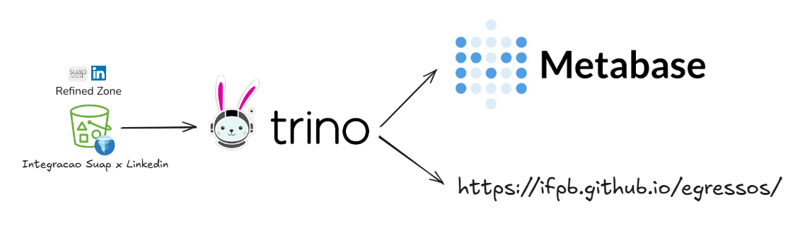

# Integração Egressos Suap x Linkedin
**Mestrado Profissional em Tecnologia da Informação - IFPB**  
Disciplina: Integração de Dados  
Professor: Diego Pessoa  
Grupo: João Victor Alcoforado de Araújo, Euridyce Karla Carvalho das Graças, Diego da Costa Fernandes e Arthur Rolim de Oliveira

## Objetivo

O objetivo do projeto é integrar os dados de egressos do Suap do Instituto Federal da Paraíba (IFPB) com os dados de egressos do LinkedIn. A partir disso, criar insights e dados úteis, como:

1. Criação de Dashboards no Metabase
2. Geração do arquivo `egressos.json` para integrar o Suap ao [IFPB Egressos](https://github.com/ifpb/egressos)



## Arquitetura

A orquestração dos pipelines foi desenvolvida utilizando o Airflow, o qual foi instalado localmente através do projeto disponibilizado pelo professor [[1]](https://github.com/ifpb/MPTI-INTEGRACAO-DADOS/tree/main/06-airflow-demo).

Criamos uma conta na AWS para construir o Data Lake no S3 e Glue. Instalamos o Trino e o Metabase em uma EC2, disponibilizando o acesso pela internet, seguindo o projeto disponibilizado pelo professor [[2]](https://github.com/diegoep/Local-Data-LakeHouse).

A comunicação com o LinkedIn foi feita usando a biblioteca [linkedin-api](https://github.com/tomquirk/linkedin-api), baseada em web scraping. Entretanto, a biblioteca possui uma issue aberta para o filtro de instituição no método `search_people`. Para garantir o desenvolvimento, criou-se um fix para o respectivo método, e a classe com a correção está disponível no `utils` do projeto.

> Atenção: O uso do respectivo web scraper pode resultar na suspensão da conta do LinkedIn.

## Data Lake

Para a construção do Data Lake, foi escolhida uma arquitetura com as seguintes camadas: Transient Landing Zone, Raw Zone, Trusted Zone e Refined Zone.


Como tecnologia de object storage, foi escolhido o S3, para que todos no projeto pudessem ter acesso a uma fonte de verdade dos dados, evitando cópias locais. Dessa forma, foram criados os seguintes buckets no S3.


É importante mencionar que os dados são armazenados na Raw Zone em Parquet, na Trusted Zone e na Refined Zone em Iceberg. Para habilitar a criação de tabelas Iceberg, usamos o Glue como Catálogo de Dados, conforme demonstrado abaixo.


## Pipeline de Dados

### Dados Egressos Suap

O Airflow foi usado como orquestrador de fluxo de dados. A principal DAG do projeto chama-se `ifpb-egressos-etl`.
O input da DAG são as planilhas de egressos do Suap, que são processadas pelas seguintes tasks, culminando na criação da tabela trusted `egressos_suap` usando Iceberg.

1. `task_ingestao_egressos_data_from_suap`
2. `task_landing_to_raw_egressos_suap_data`
3. `task_raw_to_trusted_egressos_suap_data`

### Dados Egressos LinkedIn

Em seguida, a tabela `egressos_suap` é usada como input para a extração de egressos do LinkedIn. O LinkedIn limita suas buscas a 1000 pessoas, seja usando a barra de busca ou na seção "Alumni" no perfil da instituição de ensino. Portanto, para contornar essa limitação, efetuamos a busca de egressos usando a seguinte estratégia: busca utilizando os filtros de `firstName + school`. A lista de nomes foi obtida a partir dos egressos da tabela `egressos_suap`.

Dessa forma, a primeira etapa da extração de dados do LinkedIn consistiu em buscar todos os egressos do IFPB com o primeiro nome correspondente. No entanto, nesta etapa, só obtivemos as seguintes informações:

```
    {
        "urn_id":"ACoAADO7UVLu90l9KKws",
        "distance": "DISTANCE_1",
        "jobtitle":	"Data Engineer",
        "location":	"João Pessoa, PB",
        "name": "João Victor Alcoforado"
    }
```

A segunda etapa consistiu em obter os dados completos do perfil do usuário, com informações de educação e experiência, utilizando os dados coletados até então como input. Existem diversas APIs de extração de dados de usuários do LinkedIn, todas utilizando como input a URL do perfil do usuário. A URL do perfil pode ser obtida a partir do padrão: `https://www.linkedin.com/in/{urn_id}/`.

Por fim, os dados coletados foram processados pelas seguintes tasks, culminando na criação das tabelas trusted `egressos_linkedin`, `egressos_linkedin_educacao` e `egressos_linkedin_experiencia` usando Iceberg. Os dados do LinkedIn foram divididos em 3 tabelas, uma vez que os dados de educação e experiência possuem um relacionamento `N x 1`.

1. `task_ingestao_egressos_data_from_linkedin`
2. `task_landing_to_raw_egressos_linkedin_data`
3. `task_raw_to_trusted_egressos_linkedin_data`

### Dados IFPB Egressos

O IFPB possui um repositório para exibir os alunos egressos, disponível no endereço https://ifpb.github.io/egressos/. Esse projeto exibe as informações dos alunos listados no arquivo `egressos.json`. Portanto, um dos objetivos deste projeto é gerar o arquivo `egressos.json` a partir dos dados coletados para automatizar a integração entre o Suap e o IFPB Egressos.

O arquivo `egressos.json` é gerado pela DAG `ifpb-egressos-json`, e o JSON gerado é salvo em uma pasta temporária no S3. As entidades geradas pela nossa solução possuem o seguinte schema.
```
{
    "id": 202019840000,
    "nomeCompactado": "Joao Victor",
    "nome": "Joao Victor Alcoforado",
    "email": "joaovictor.alcof@gmail.com",
    "curso": "mpti",
    "campus": "ifpb-jp",
    "egresso": false,
    "linkedin": "https://www.linkedin.com/in/joaovictoralcoforado/"
}
```


## Trino e Metabase

Uma EC2 foi criada na AWS para hospedar o Trino e o Metabase, a fim de disponibilizar acesso remoto aos dados e habilitar a criação de Dashboards. O Metabase está disponível no endereço: http://ec2-54-175-216-250.compute-1.amazonaws.com:3000. Você pode acessá-lo com as seguintes credenciais:

```
Email: test@testmail.com  
Password: test123!
```

Um dos desafios do projeto foi conectar o Trino ao Glue e, posteriormente, o Metabase ao Trino para ler tabelas Iceberg. A imagem abaixo exibe a integração bem-sucedida entre esses componentes.


### Configuração Glue-Trino

```
# iceberg.properties
connector.name=iceberg
iceberg.catalog.type=glue
hive.metastore.glue.region=
hive.metastore.glue.default-warehouse-dir=s3://
hive.metastore.glue.aws-access-key=
hive.metastore.glue.aws-secret-key=
hive.s3.aws-access-key=
hive.s3.aws-secret-key=
```
```
# hive.properties
connector.name=hive
hive.metastore=glue
hive.metastore.glue.region=
hive.metastore.glue.default-warehouse-dir=s3://
hive.metastore.glue.aws-access-key=
hive.metastore.glue.aws-secret-key=
hive.s3.aws-access-key=
hive.s3.aws-secret-key=
```

### Configuração Trino-Metabase

A integração Trino-Metabase requer a instalação do driver `starburst-2.0.0.metabase-driver.jar` no Metabase.

## Conclusão

O projeto foi cuidadosamente pensado em termos de arquitetura e padrões de código. Construímos uma infraestrutura de dados self-hosted funcional, que pode ser acessada remotamente. No entanto, não alcançamos avanços significativos nos requisitos de resolução de entidades da integração e na criação de dashboards.


